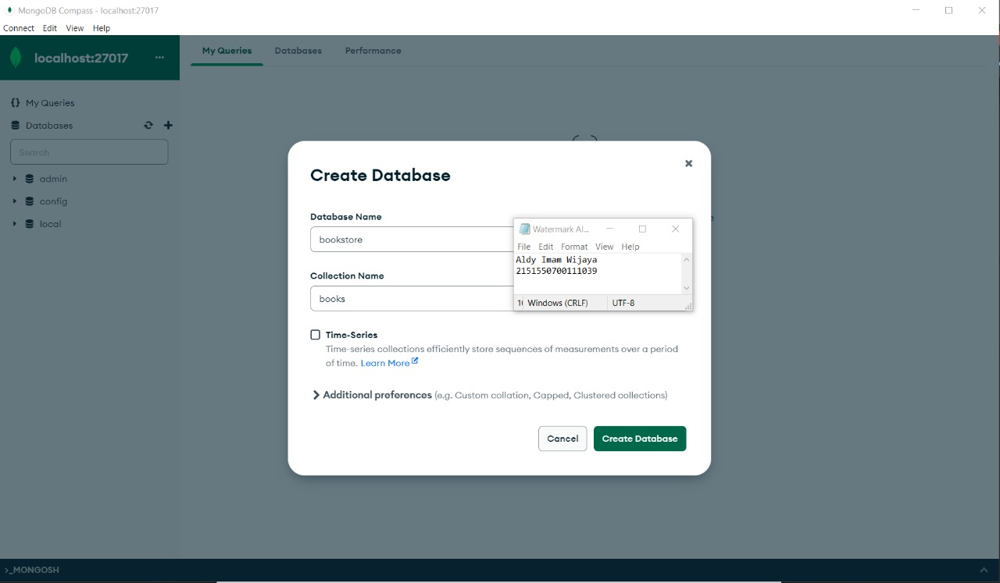
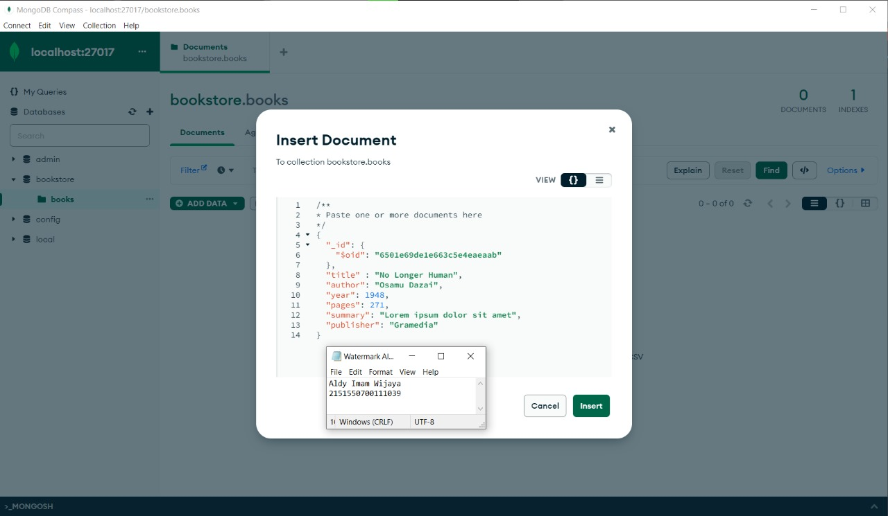
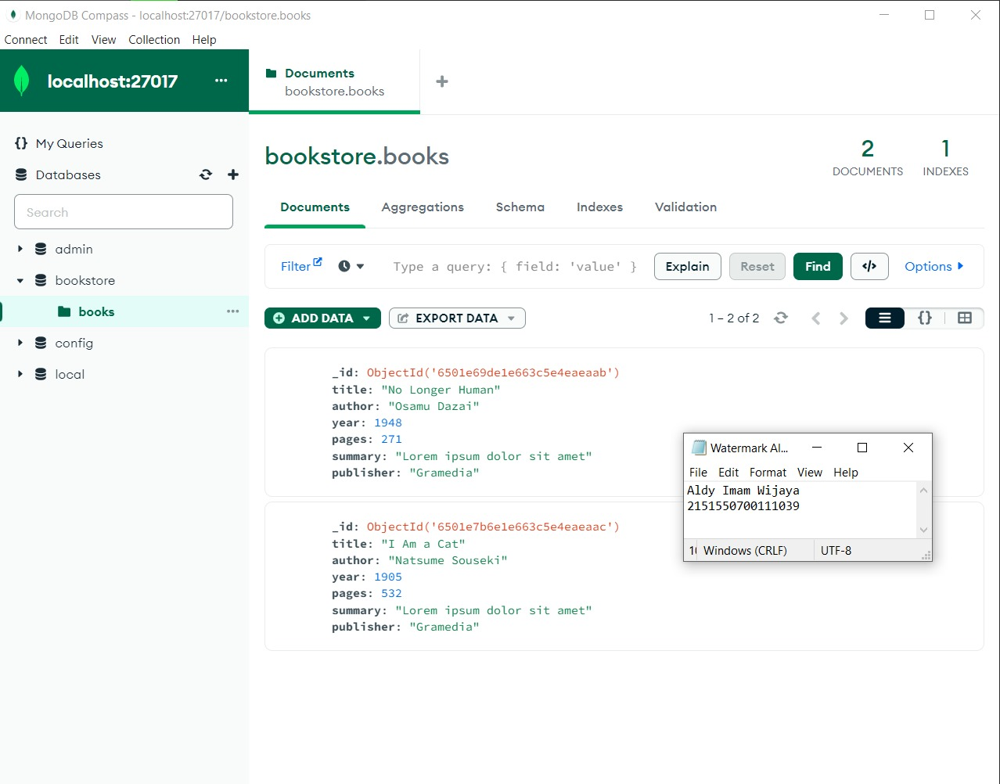
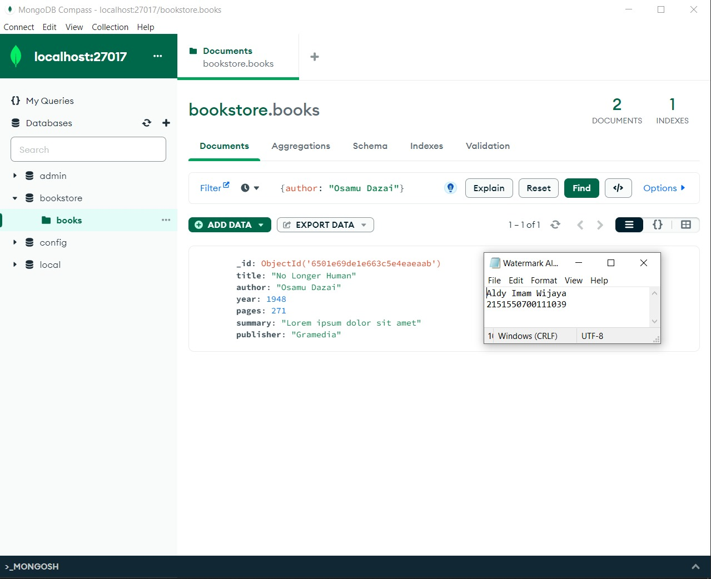
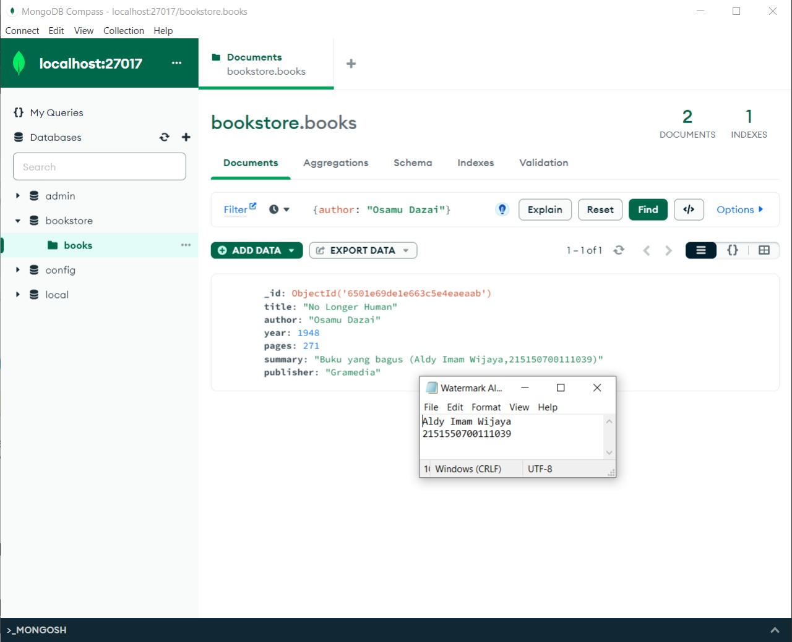
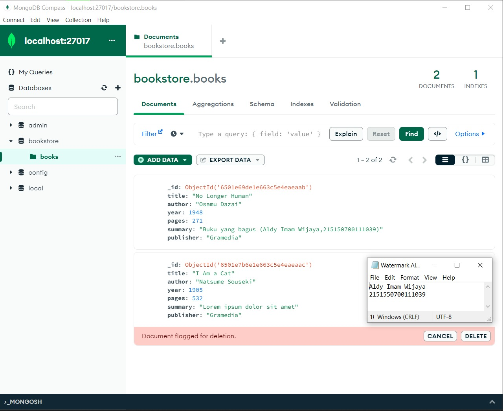
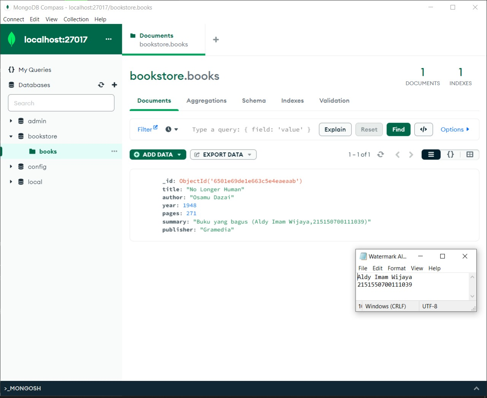
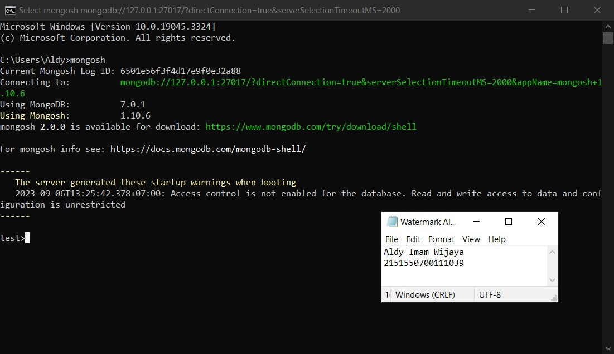

# Dasar Teori

## MongoDB Compass

MongoDB Compass adalah tool berbasis Graphical User Interface (GUI) yang
digunakan untuk berinteraksi dengan MongoDB yang terpasang secara on-premise dan
MongoDB Atlas yang berbasis cloud. Tool ini dapat melakukan aktivitas dasar seperti
CREATE, READ, UPDATE, dan DELETE (CRUD) tanpa berhadapan dengan baris
perintah (command line)

## MongoDB Shell

CRUD MongoDB Compass dan Shell 2
Walaupun dapat melakukan operasi seperti MongoDB Compass, interaksi yang
dilakukan MongoDB Shell berbasis Command Line Interface (CLI) sehingga diperlukan
baris perintah untuk melakukan aktivitas dasar. MongoDB Shell dapat diakses langsung
dari MongoDB Compass atau menggunakan mongosh pada Command Prompt 

# Langkah percobaan

## MongoDB Compass
1. Lakukan koneksi ke MongoDB menggunakan connection string. <br><br>
 <br><br>
2. Buat database dengan melakukan klik “Create Database”. <br><br>
 <br><br>
3. Lakukan insert buku pertama dengan melakukan klik “Add Data”, pilih “Insert Document”, isi dengan data yang diinginkan dan klik “Insert”. <br><br>
 <br><br>
4. Lakukan insert buku kedua dengan cara yang sama. <br><br>
 <br><br>
5. Lakukan pencarian buku dengan author “Osamu Dazai” dengan mengisi filter yang diinginkan dan klik “Find”. <br><br>
 <br><br>
6. Lakukan perubahan summary pada buku “No Longer Human” menjadi “Buku yang bagus (NAMA,NIM) dengan melakukan klik “Edit Document” (berlambang pensil), mengisi nilai summary yang baru, dan melakukan klik “Update”. <br><br>
 <br><br>
7. Lakukan penghapusan pada buku “I Am a Cat” dengan melakukan klik “Remove Document” (berlambang tong sampah) dan melakukan klik “Delete”. <br><br>
 <br><br>

## MongoDB Shell
1. Lakukan koneksi ke MongoDB Server dengan menjalankan command mongosh bagi yang menggunakan terminal build in OS sehingga tampilan terminal kalian akan menjadi seperti berikut. <br>
 <br>
2. Mencoba melihat list database yang ada di server dengan menjalankan command ```show dbs``` <br>
   Untuk berpindah ke database “bookstore” gunakan command ```use bookstore``` , kalian dapat memastikan telah berpindah ke database yang benar dengan melihat tulisan sebelum tanda “>”. <br>
   Cobalah untuk melihat collection yang ada pada database tersebut dengan menggunakan command ```show collections```. <br>
   Kalian juga bisa berpindah ke database yang belum pernah kalian buat sebelumnya, dengan menggunakan command ```db.<nama 
collections>.insert<One/Many>()``` dan MongoDB akan otomatis membuatkan database dan collections.
3. Lakukan insert buku “Overlord I” dengan menggunakan command ```db.books.insertOne(<data kalian>)``` , setelah insert buku berhasil maka MongoDB akan mengembalikan pesan sebagai berikut.
4. Lakukan insert buku “The Setting Sun” dan “Hujan” dengan insert many dengan menggunakan command ```db.books.insertMany(<data kalian>)``` , dan akan CRUD MongoDB Compass dan Shell 9 mengembalikan pesan sebagai berikut.
5. Lakukan pencarian buku dengan menggunakan command db.books.find() untuk melakukan pencarian semua buku.
6. Tampilkan seluruh buku dengan author “Osamu Dazai” dengan mengisi argument pada find() dengan menggunakan command ```db.books.find({<filter yang ingin diisi>})```.
7. Lakukan perubahan summary pada buku “Hujan” menjadi “Buku yang bagus (NAMA,NIM) dengan mengunakan command ```db.books.updateOne({<filter>}, {$set: {<data yang akan di update>}})``` sehingga output yang dihasilkan oleh MongoDB akan menjadi seperti berikut.
8. Lakukan perubahan publisher menjadi “Yen Press” pada semua buku “Osamu Dazai” dengan menggunakan command ```db.books.updateMany({<filter>}, {$set: {<data yang akan di update>}})```.
9. Lakukan penghapusan pada buku “Overlord I” dengan menggunakan command ```db.books.deleteOne({<argument>})```.
10. Lakukan penghapusan pada semua buku “Osamu Dazai dengan menggunakan command ```db.books.deleteMany({<argument>})```.
