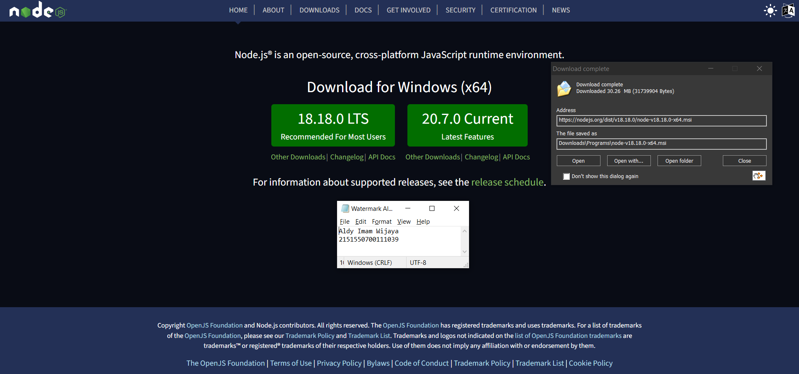

# Dasar Teori 

## Express
Express.js adalah framework web app untuk Node.js yang ditulis dengan bahasa
pemrograman JavaScript. Framework open source ini dibuat oleh TJ Holowaychuk
pada tahun 2010 lalu. <br>

Integrasi MongoDB dan Express 2
Express.js adalah framework back end. Artinya, ia bertanggung jawab untuk mengatur
fungsionalitas website, seperti pengelolaan routing dan session, permintaan HTTP,
penanganan error, serta pertukaran data di server.<br>

## Mongoose
Mongoose adalah pustaka berbasis Node.js yang digunakan untuk pemodelan data
pada MongoDB. Mongoose menyediakan feature diantaranya, model data application
berbasis Schema. Dan juga termasuk built-in type casting, validation, query building,
business logic hooks dan masih banyak lagi yang menjadi ke andalan mongoose.

## Async Await
Async sendiri merupakan sebuah fungsi yang mengembalikan sebuah Promise. Await
sendiri merupakan fungsi yang hanya berjalan di dalam Async. Await bertujuan untuk
menunda jalannya Async hingga proses dari Await tersebut berhasil dieksekusi.

## Model
Model merupakan bagian yang bertugas untuk menyiapkan, mengatur, memanipulasi,
dan mengorganisasikan data yang ada di database.

## Controller
Controller merupakan bagian yang menjadi tempat berkumpulnya logika pemrograman
yang digunakan untuk memisahkan organisasi data pada database. Dalam beberapa
kasus, controller menjadi penghubung antara model dan view pada arsitektur MVC

## Route
Router mengatur pintu masuk yang berupa request pada aplikasi, mereka memilah dan
mengolah request url untuk kemudian diproses sesuai dengan tujuan akhir url tersebut.
Bisa jadi url tersebut berfungsi untuk mengambil data kemudian menampilkannya,
menghapus data, menampilkan form, sampai mengolah session.

# Kebutuhan Instalasi
1. NodeJS
2. API Client (seperti postman, Insomnia, RapidAPI, dll)

# Langkah Percobaan
## Percobaan instalasi NodeJS
1. Buka halaman ```https://nodejs.org/en``` <br><br>

2. Download dan jalankan node setup



3. Setelah instalasi selesai jalankan command ```node -v``` untuk memeriksa apakah NodeJS sudah terinstall <br><br>


## Inisiasi project Express dan pemasangan package
1. Lakukan pembuatan folder dengan nama express-mongodb dan masuk ke dalam folder tersebut lalu buka melalui text editor masing-masing.
2. Lakukan npm init untuk mengenerate file package.json dengan menggunakan command ```npm init -y```.
3. Lakukan instalasi express, mongoose, dan dotenv dengan menggunakan command ```npm i express mongoose dotenv```.

## Koneksi Express ke MongoDB
1. Buatlah file index.js pada root folder dan masukkan kode di bawah ini.
   `aaaaaaaaaaaaaaaaaaaaaaa` <br>
   Setelah itu coba jalankan aplikasi dengan command ```node index.js```
2. Lakukan pembuatan file **.env** dan masukkan baris berikut : <br>
   `PORT = 5000` <br>
   Setelah itu ubahlah kode pada listening port menjadi berikut dan coba jalankan aplikasi kembali <br>
   `aaaaaaaaaaaaaaaaaaaaaaa`
3. Copy connection string yang terdapat pada compas atau atlas dan paste kan pada **.env** seperti berikut : <br>
   `MONGO_URI=<Connection string masing-masing>` <br>
4. Tambahkan baris kode berikut pada file index.js <br>
   `aaaaaaaaaaaaaaaaaaa` <br>
   Setelah itu coba jalankan aplikasi kembali

## Pembuatan routing 
1. Lakukan pembuatan direktori routes di tingkat yang sama dengan index.js.
2. Buatlah file book.route.js di dalamnya
3. Tambahkan baris kode berikut untuk fungsi getAllBooks <br>
   `aaaaaaaaaaaa`
4. Lakukan hal yang sama untuk getOneBook, createBook, updateBook, dan deleteBook <br>
   `aaaaaaaaaaaa`
5. Lakukan import book.route.js pada file index.js dan tambahkan baris kode berikut : <br>
   `aaaaaaaaaaaa`
6. Uji salah satu endpoint dengan Postman

## Pembuatan controller
1. Lakukan pembuatan direktori controllers di tingkat yang sama dengan index.js.
2. Buatlah file book.controller.js di dalamnya
3. Salin baris kode dari routes untuk fungsi getAllBooks <br>
   `aaaaaaaaaa`
4. Lakukan hal yang sama untuk getOneBook, createBook, updateBook, dan deleteBook <br>
   `aaaaaaaaaa`
5. Lakukan import book.controller.js pada file book.route.js <br>
   `aaaaaaaaaa`
6. Lakukan perubahan pada fungsi agar dapat memanggil fungsi dari book.controller.js <br>
   `aaaaaaaaaa`
7. Lakukan pengujian kembali, pastikan response tetap sama

## Pembuatan model
Berikut adalah gambaran bentuk data dari modul sebelumnya <br>

<table>
 	<tr>
 		<td> title </td>
 		<td> string </td>
 	</tr>
 	<tr>
 		<td> author </td>
 		<td> string </td>
 	</tr>
  <tr>
 		<td> year </td>
 		<td> number </td>
 	</tr>
  <tr>
 		<td> pages </td>
 		<td> number </td>
 	</tr>
  <tr>
 		<td> summary </td>
 		<td> string </td>
 	</tr>
  <tr>
 		<td> publisher </td>
 		<td> string </td>
 	</tr>
 </table>

 1. Lakukan pembuatan direktori models di tingkat yang sama dengan index.js
 2. Buatlah file book.model.js di dalamnya
 3. Tambahkan baris kode berikut sesuai dengan tabel di atas <br>
    `aaaaaaaa`

## Operasi CRUD 
1. Hapus semua data pada collection books
2. Lakukan import book.model.js pada file book.controller.js <br>
   `aaaaaa`
3. Lakukan perubahan pada fungsi createBook <br>
   `aaaaaa`
4. Buatlah dua buah buku dengan data di bawah ini dengan Postman <br>
   `aaaaaa`
5. Lakukan perubahan pada fungsi getAllBooks <br>
   `aaaaaa`
6. Lakukan perubahan pada fungsi getOneBook <br>
   `aaaaaa`
7. Tampilkan semua buku dengan Postman
8. Tampilkan buku Dilan 1990 dengan Postman
9. Lakukan perubahan pada fungsi updateBook <br>
   `aaaaaa`
10. Ubah judul buku Dilan 1991 menjadi “NAMA PANGGILAN 1991” dengan Postman
11. Lakukan perubahan pada fungsi deleteBook <br>
   `aaaaaaa`
12. Hapus buku Dilan 1990 dengan Postman.
