# Dynamic Route dan Middleware

## Tujuan
Setelah mengikuti praktikum ini, mahasiswa diharapkan dapat :
1. Melakukan dinamic routing.
2. Melakukan alias route.
3. Melakukan group route.
4. Melakukan Middleware

## Langkah Percobaan 
1. Dynamic Route

Dynamic route adalah route yang dapat berubah-ubah, contohnya pada saat kita membuka
suatu halaman web, kadang kita melihat ```/users/1``` atau ```/users/2``` , hal ini yang dinamakan
dynamic routes.
Untuk menambahkan dynamic routes pada aplikasi lumen kita, kita dapat menggunakan
syntax berikut : 
```
$router->get('/user/{id}', function ($id) {
  return 'User Id = ' . $id;
});
```
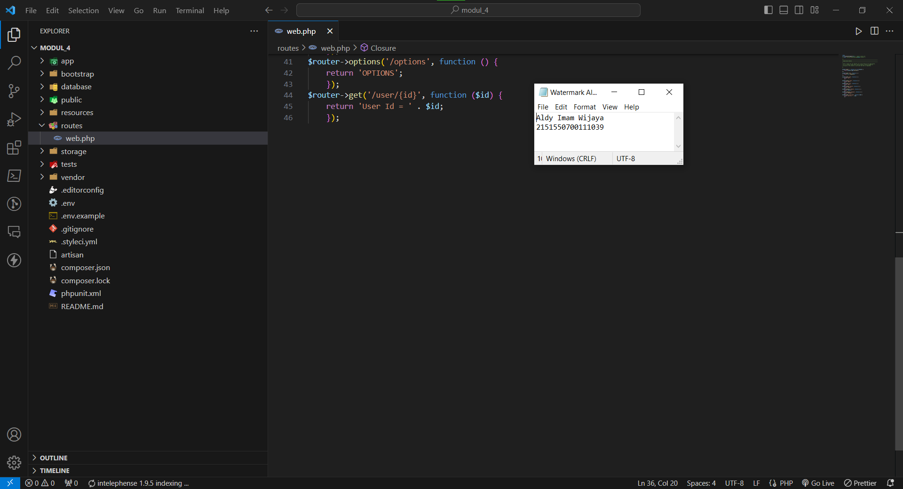 <br><br>
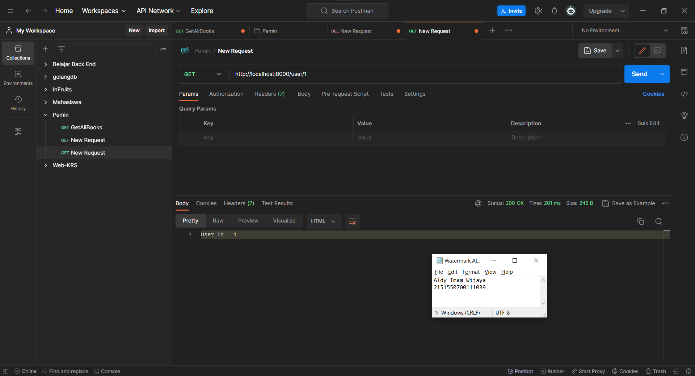 <br><br>
Saat menambahkan parameter pada routes, kita tidak terbatas pada 1 variable saja, namun
kita dapat menambahkan sebanyak yang diperlukan seperti kode berikut : 
```
$router->get('/post/{postId}/comments/{commentId}', function ($postId, $commentId) {
  return 'Post ID = ' . $postId . ' Comments ID = ' . $commentId;
});
```
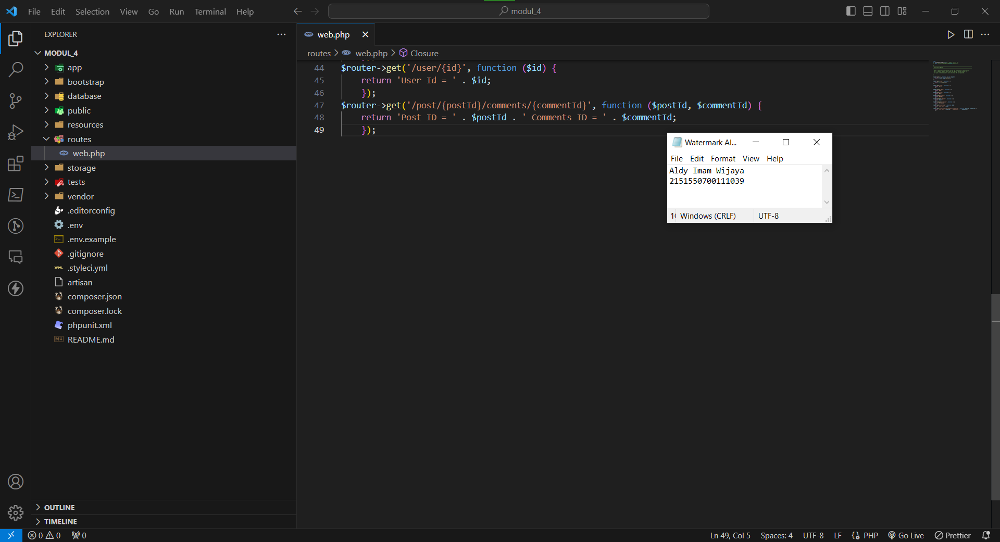 <br><br>
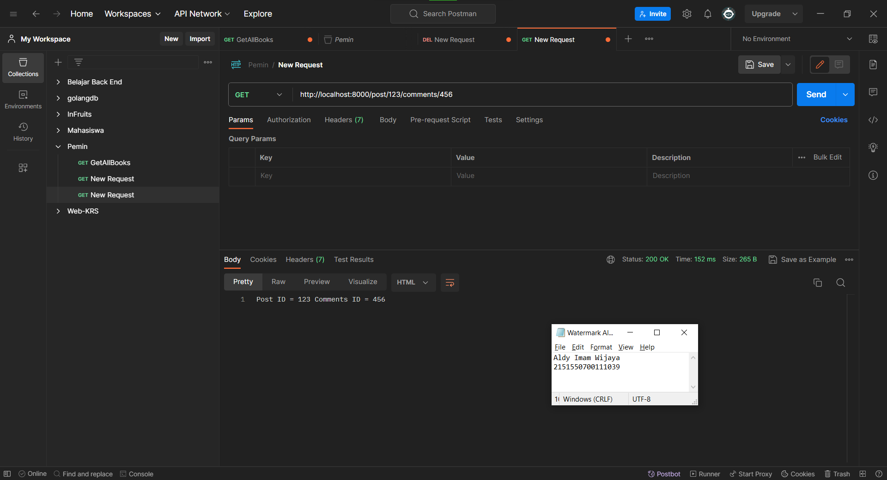 <br><br>
Pada dynamic routes kita juga bisa menambahkan optional routes, yang mana optional routes tidak mengharuskan kita untuk memberi variable pada endpoint kita, namun saat kita memanggil endpoint, dapat menggunakan parameter variable ataupun tidak, seperti pada kode dibawah ini : 
```
$router->get('/users[/{userId}]', function ($userId = null) {
  return $userId === null ? 'Data semua users' : 'Data user dengan id ' . $userId;
});
```
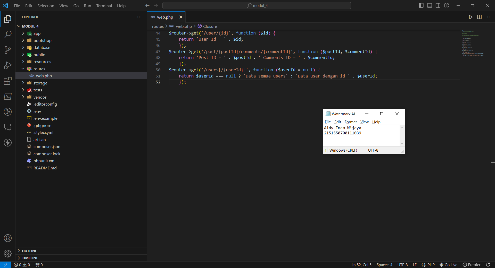 <br><br>
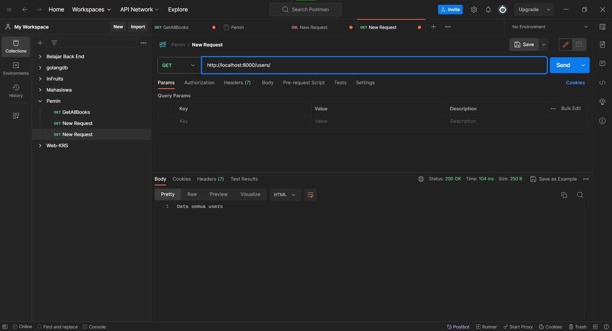 <br><br>
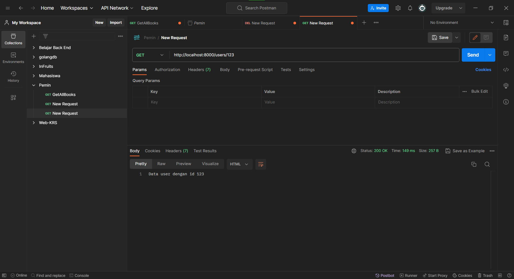 <br><br>
2. Aliases Route
   
Aliases Route digunakan untuk memberi nama pada route yang telah kita buat, hal ini dapat membantu kita, saat kita ingin memanggil route tersebut pada aplikasi kita. Berikut syntax untuk menambahkan aliases route
```
$router->get('/auth/login', ['as' => 'route.auth.login', function (...) {...}])
...
$router->get('/profile', function (Request $request) {
  if ($request->isLoggedIn) {
    return redirect()->route('route.auth.login');
  }
});
```
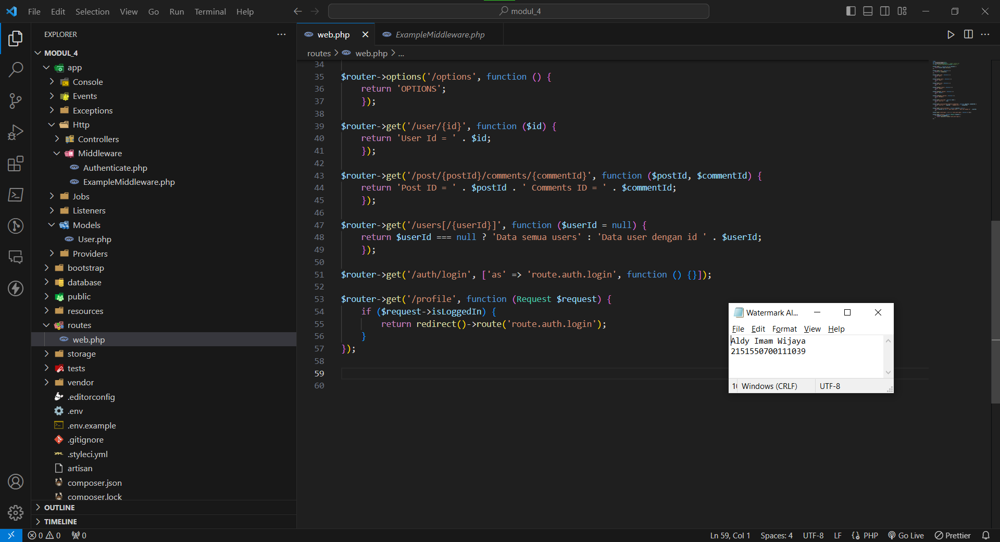 <br><br>
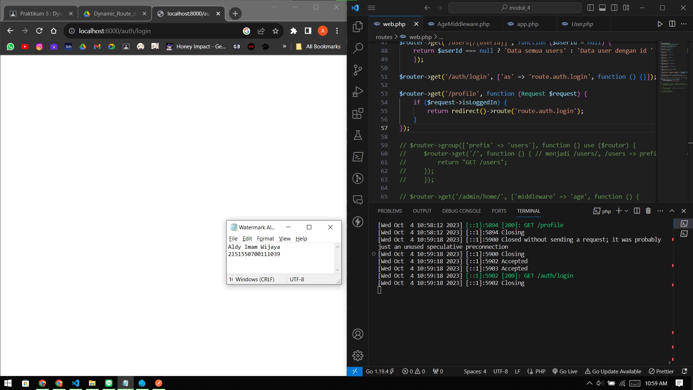 <br><br>
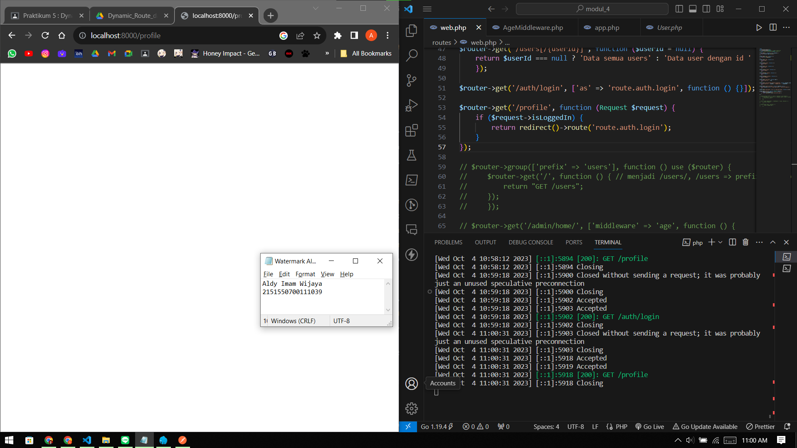 <br><br>
3. Group Route
   
Pada lumen, kita juga dapat memberikan grouping pada routes kita agar lebih mudah pada saat penulisan route pada web.php kita. Kita dapat melakukan grouping dengan menggunakan syntax berikut :
```
$router->group(['prefix' => 'users'], function () use ($router) {
  $router->get('/', function () { // menjadi /users/, /users => prefix, / => path
    return "GET /users";
  });
});
```
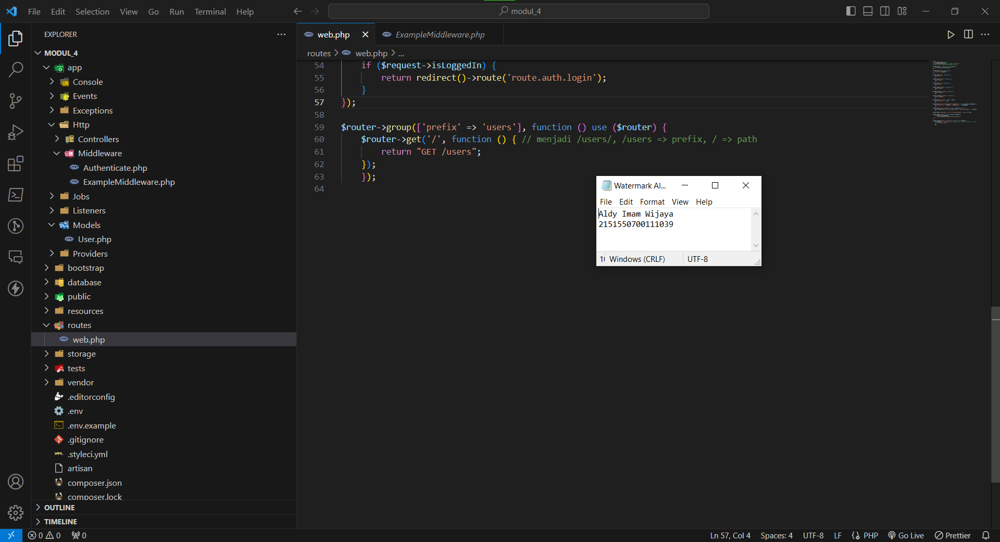 <br><br>
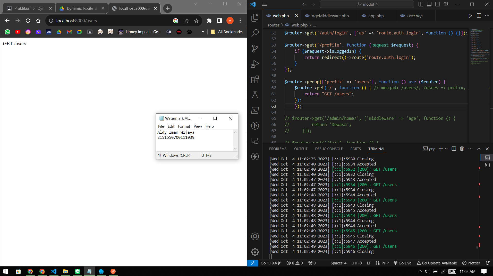 <br><br>
Selain dapat mengelompokkan prefix, kita juga dapat mengelompokkan middleware dan
namespace pada kelompok routes kita.

4. Middleware
   
Middleware adalah penengah antara komunikasi aplikasi dan client. Middleware biasanya digunakan untuk membatasi siapa yang dapat berinteraksi dengan aplikasi kita dan semacamnya, kita dapat menambahkan middleware dengan menambahkan file pada folder```app/Http/Middleware``` . Pada folder tersebut terdapat file ```ExampleMiddleware``` , kita dapat men- copy file tersebut untuk membuat middleware baru.

Pada praktikum kali ini akan dibuat middleware Age dengan isi : 
```
<?php
namespace App\Http\Middleware;
use Closure;
class AgeMiddleware
{
  /**
    * Handle an incoming request.
    *
    * @param \Illuminate\Http\Request $request
    * @param \Closure $next
    * @return mixed
    */
    public function handle($request, Closure $next)
    {
      if ($request->age < 17)
        return redirect('/fail');
      return $next($request);
    }
}
```
 <br><br>
Kemudian, setelah menambahkan filter pada ```AgeMiddleware``` , kita harus mendaftarkan
```AgeMiddleware``` pada aplikasi kita, pada file ```bootstrap/app.php``` seperti berikut ini :

```
73 ...
74
75 // $app->middleware([
76 //   App\Http\Middleware\ExampleMiddleware::class
77 // ]);
78
79 $app->routeMiddleware([
80 //       'auth' => App\Http\Middleware\Authenticate::class,
81     'age' => App\Http\Middleware\AgeMiddleware::class
82   ]);
83
84 ...
```
 <br><br>
Pada baris 65 terdapat comment mengenai proses mendaftarkan suatu middleware dalam aplikasi kita. Untuk menambahkan middleware pada aplikasi kita, kita dapat men-uncomment baris 75 hingga 77, kemudian menambahkan age middleware ke dalamnya.

Namun, karena kita hanya ingin menambahkan middleware pada route tertentu, kita akan
menghapus comment pada baris 79 hingga 81, kemudian menambahkan middleware age di
dalamnya.

Lalu, kita dapat menambahkan middleware pada routes kita dengan menambahkan opsi
middleware pada salah satu route, contohnya : 

```
$router->get('/admin/home/', ['middleware' => 'age', function () {
  return 'Dewasa';
}]);
$router->get('/fail', function () {
  return 'Dibawah umur';
});
```
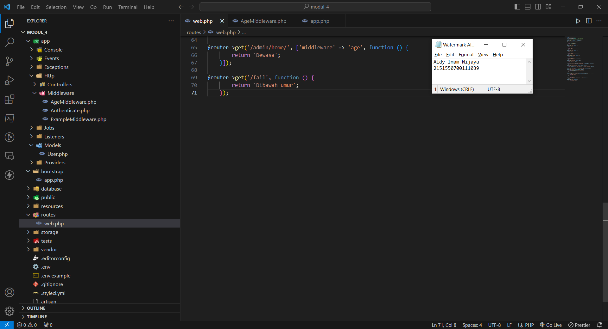 <br><br>
